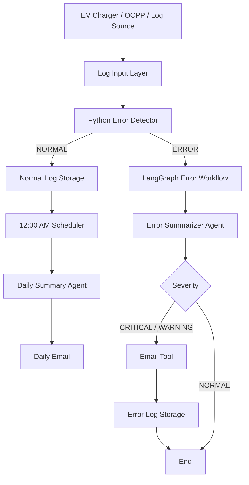

# ⚡ EV Network Intelligence — Log Automation

> An agentic AI system for monitoring EV charging logs, detecting charging failures, analyzing incidents with an LLM, notifying the charger owner, and generating automated daily operational summaries.

## Overview

EV charging networks continuously generate operational telemetry and protocol messages. Manually inspecting these logs is slow, difficult to scale, and makes it easy to miss important failures.

**EV Network Intelligence — Log Automation** combines deterministic Python-based monitoring with a LangGraph agentic workflow.

The system separates **fast, reliable detection** from **LLM-based reasoning**:

* Python detects confirmed abnormal conditions.
* LangGraph orchestrates the incident-analysis workflow.
* An LLM converts a confirmed incident into a structured operational assessment.
* A mail tool performs an external action when the incident is significant.
* Normal logs are retained for operational analysis.
* A scheduler generates a daily network summary automatically.

The architecture is intentionally designed so that the current Excel-based prototype can later accept **live OCPP/CSMS data** without rebuilding the agent workflow.

---

## Architecture

### High-level architecture



## 📁 Project Structure

```text
Log_Analyser/
│
├── agents/
│   ├── error_agent.py
│   ├── error_detector.py
│   ├── error_email_agent.py
│   ├── mail_agent.py
│   └── summarize_agent.py
│
├── workflow/
│   ├── __init__.py
│   └── ev_workflow.py
│
├── logs_data/
│   ├── normal/
│   │   └── normal_logs.csv
│   └── error/
│       └── error_logs.csv
│
├── docs/
│   └── architecture.png
│
├── Charger_Logs_10.xlsx
├── main.py
├── scheduler.py
├── logsfile_generator.py
├── pyproject.toml
├── requirements.txt
├── uv.lock
├── .gitignore
├── .env.example
└── README.md
```

## Setup

### 1. Clone the repository

```bash
git clone https://github.com/Srikar282006/Logs-Automation.git
cd Logs-Automation
```

### 2. Create Environment

```bash
uv venv
```

### 3. Activate the virtual environment

```powershell
.venv\Scripts\activate
```

### 4. Install packages

```bash
pip install -r requirements.txt
```

## Running Application

```bash
uv run python main.py
```

## Environment Variables

```env
GROQ_API_KEY=your_groq_api_key
ERROR_LLM=your_error_llm_api_key
EMAIL_ADDRESS=your_sender@gmail.com
EMAIL_PASSWORD=your_google_app_password
OWNER_EMAIL=owner@gmail.com
```
